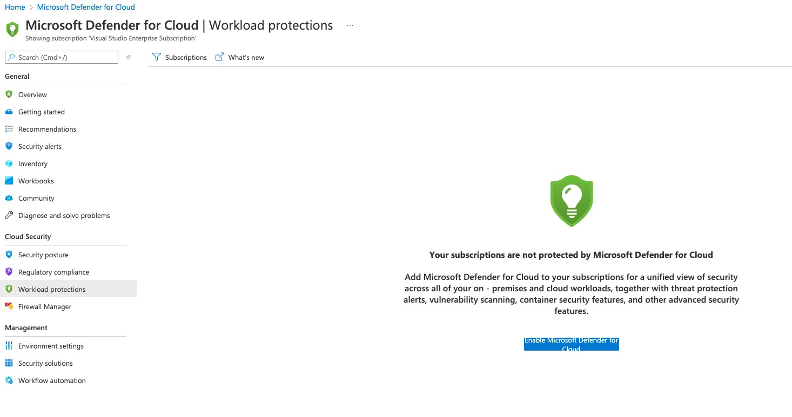
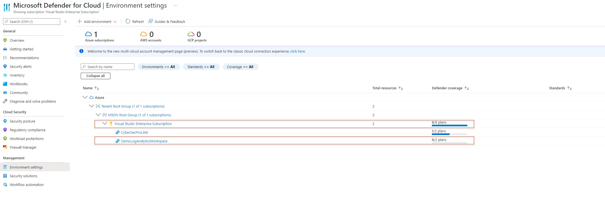
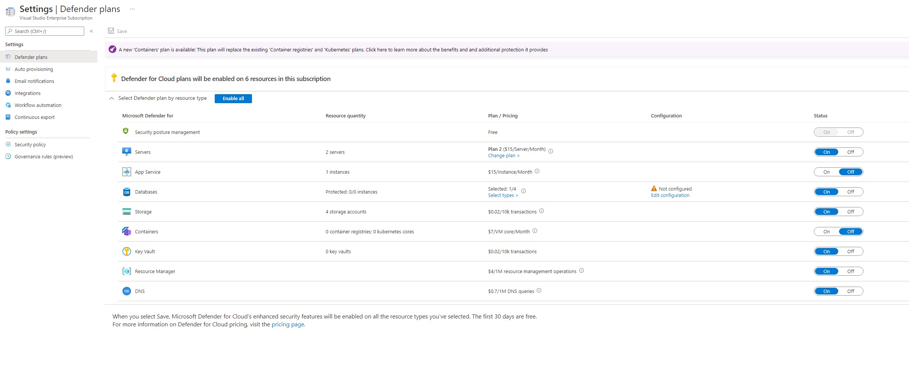
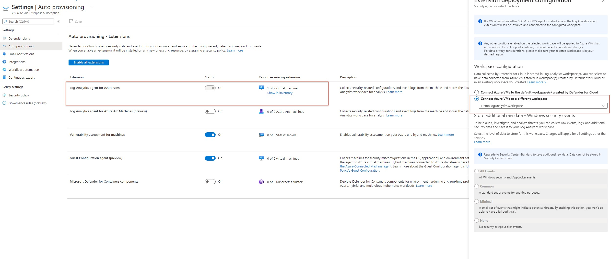
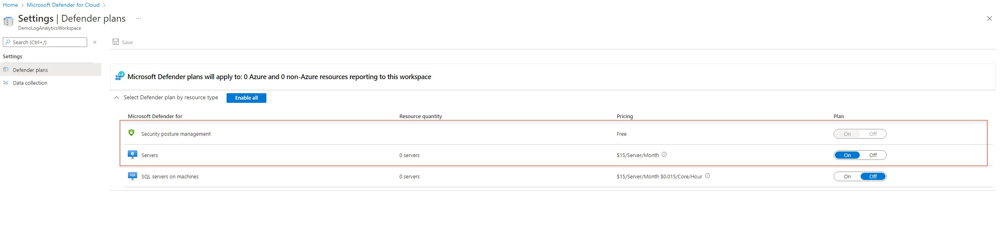
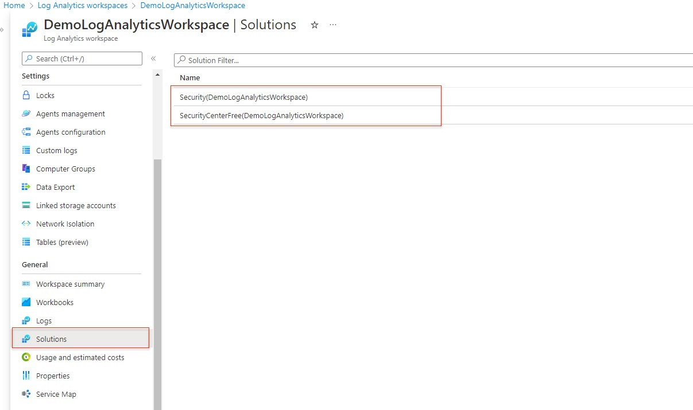
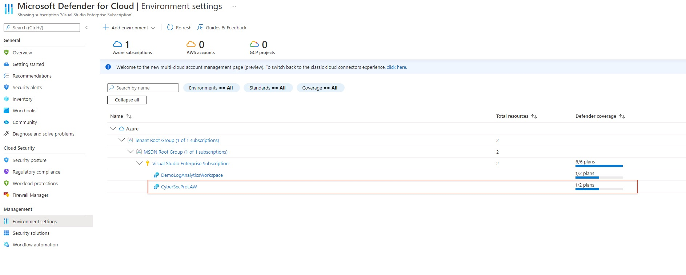
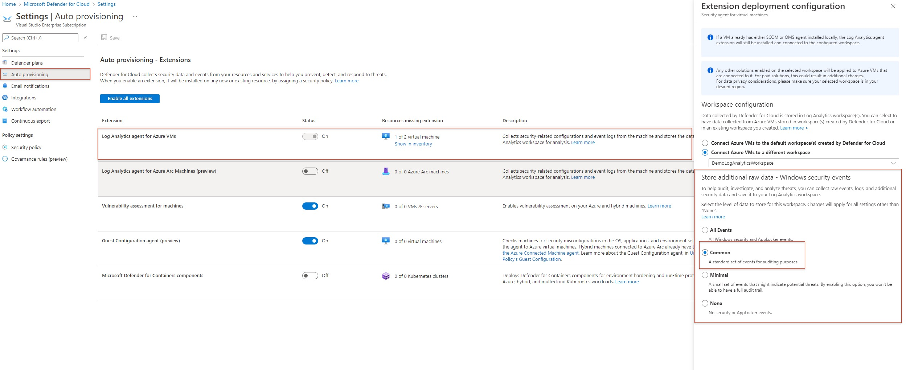
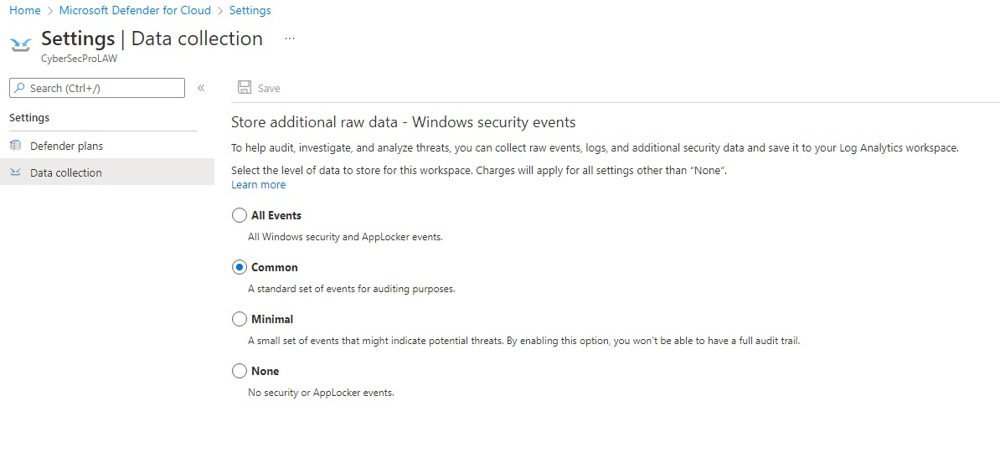

# Microsoft Defender for Cloud - Onboard new subscription with a different log analytics workspace

**Author: Rotem Simhi**

## Description

I was asked to create a seemless onboarding experience for new subscriptions created for a customer's tenant. I could not find a single guide that gave me the expected result of an automated procedure which I could integrate in my subscription creation pipeline. So I have created this walkthrough to help with the process.



### First, the beginning 

We need to import some AZ modules and connect to our tenant. 

```
#Requires -Modules az.security
#Requires -Modules az.monitoringsolutions

# Define the Params
Param(
    $SubscriptionId    = '<SubscriptionId>',
    $ResourceGroupName = '<ResourceGroupName>',
    $WorkSpaceName     = '<WorkSpaceName>',
    $tenantID          = '<tenantID>'
)

Connect-AzAccount -Tenant $tenantID -SubscriptionId $SubscriptionId
```

Running in an Azure DevOps pipeline we are able to use the existing connection of the service principle and set the context with the predefined subscription. but for we would need to set the context of the connection to a variable for later.

```
# Set the context of the script to apply only to the chosen subsctiption
$Context  = Set-AzContext -SubscriptionId $SubscriptionId
```

Now we can register Microsoft.Security as a resource provider in the new subscription.

```
Register-AzResourceProvider -ProviderNamespace 'Microsoft.Security'

```

### Onboard your subscription to Defender for Cloud

Choose the Defender plans you plan to enable, you could choose from the list:
```
<# Defender Plan List
VirtualMachines              
SqlServers                   
AppServices                  
StorageAccounts              
SqlServerVirtualMachines     
KubernetesService            
ContainerRegistry            
KeyVaults                    
Dns                          
Arm                          
OpenSourceRelationalDatabases
CosmosDbs                    
Containers
#>

$DefenderPlans = @(
                    'Arm',
                    'KeyVaults', 
                    'VirtualMachines', 
                    'StorageAccounts', 
                    'SqlServerVirtualMachines', 
                    'Dns'
                    )

# Get a list of the free plans currently deployed on the subscription
$SecurityPricing = Get-AzSecurityPricing | Where-Object {($_.name -in $DefenderPlans) -and ($_.PricingTier -eq 'Free')}

# Enable the standard plan for each of the Defender plans chosen above
foreach ($DefenderPlan in $SecurityPricing){
        Set-AzSecurityPricing -Name $DefenderPlan.Name -PricingTier "Standard" 
}

```





### Configure Environment Settings for the Subscription in the Defender for Cloud
Set the Subscription to send data to a specific workspace and enable Auto Provisioning.

```
$WorkspaceSettingName = "default"
Set-AzSecurityWorkspaceSetting -Name $WorkspaceSettingName `
    -Scope "/subscriptions/$SubscriptionId" `
    -WorkspaceId "/subscriptions/$SubscriptionId/resourcegroups/$ResourceGroupName/providers/microsoft.operationalinsights/workspaces/$WorkSpaceName"

Set-AzSecurityAutoProvisioningSetting -Name $WorkspaceSettingName -EnableAutoProvision
```




### Enable the Log Analytics Workspace Solution

```
$Workspace = Get-AzOperationalInsightsWorkspace -ResourceGroupName $ResourceGroupName -Name $WorkSpaceName

$SolutionTypes = @('Security', 'SecurityCenterFree')
foreach ($SolutionType in $SolutionTypes) {
    New-AzMonitorLogAnalyticsSolution -ResourceGroupName $ResourceGroupName `
                                  -Location $workspace.Location `
                                  -WorkspaceResourceId $WorkSpace.ResourceId `
                                  -Type $SolutionType
}
```






### Set Security event collection tier
This section is tricky as it requires us to create a request header using our bearer token from the session (This is where we use the $Context variable again).
After that we need to choose the collection tier we want and invoke a web request to deploy our changes.

```
$tenantID = $Context.Tenant.Id
$tokenCache = Get-AzAccessToken -TenantId $tenantID
$requestHeader = @{
    "Authorization" = "{0} {1}" -f $tokenCache.Type, $tokenCache.Token
    "Content-Type"   = "application/json"
}

# Choose: "None", "Minimal", "Recommended" (for "Common") or "All" (for "All Events")
$SecurityEventCollectionTier = "Recommended"

# Create the Body
$Properties = @{Tier = $SecurityEventCollectionTier}
$Body       = @{kind = "SecurityEventCollectionConfiguration"}
$Body.add("properties", $Properties)

$jsonBody = $Body | ConvertTo-Json

# Generate the request URI
$RestURI = 'https://management.azure.com/subscriptions/{0}/resourcegroups/{1}/providers/Microsoft.OperationalInsights/Workspaces/{2}/datasources/SecurityEventCollectionConfiguration?api-version=2015-11-01-preview' -f $SubscriptionId, $ResourceGroupName, $WorkSpaceName
Invoke-RestMethod -Uri $RestURI -Method Put -Body $jsonBody -Headers $requestHeader
```





[The full script](./New-AzDefenderforCloudSubscription.ps1) has been created to enable defender plans, auto provisioning and the configuration of a new log analytics workspace on an existing subscription. It is seperated into regions so that you could choose which part you need for yourself.


### Prerequisites

- You need to run the script with a user account that has **Security Admin** access rights to enable/disable Microsoft Defender plans.
- You need to run the script with a user account that has workspace permissions to [add and remove monitoring solutions](https://docs.microsoft.com/en-us/azure/azure-monitor/logs/manage-access?tabs=portal#azure-rbac) (These permissions need to be granted at a resource group or subscription level).
- Make sure to use the latest version of the [Az.Security PowerShell module](https://docs.microsoft.com/powershell/module/az.security).
- Make sure to use the latest version of the [Az.monitoringsolutions PowerShell module](https://docs.microsoft.com/powershell/module/az.monitoringsolutions).
